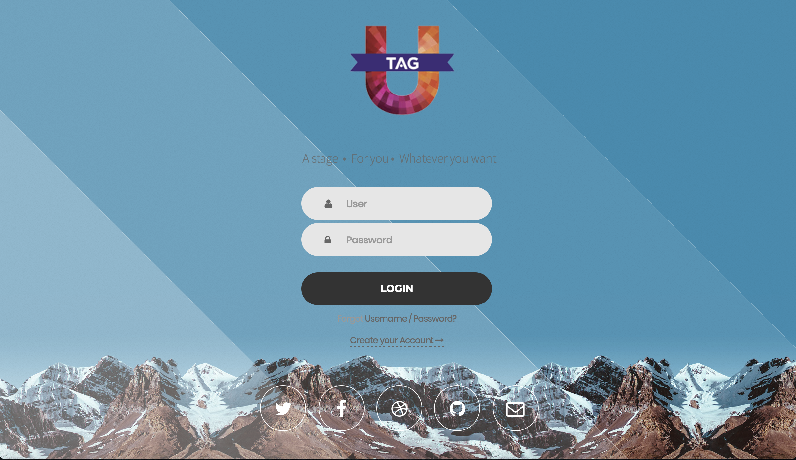
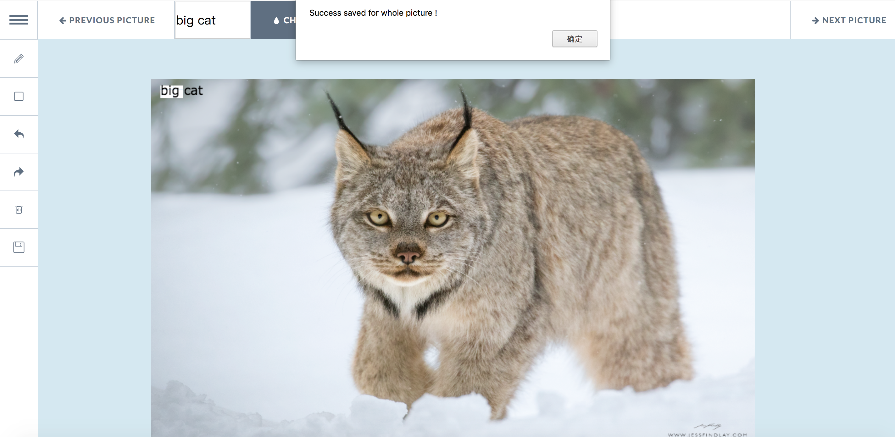
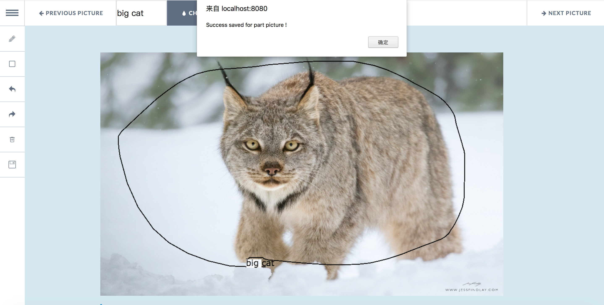
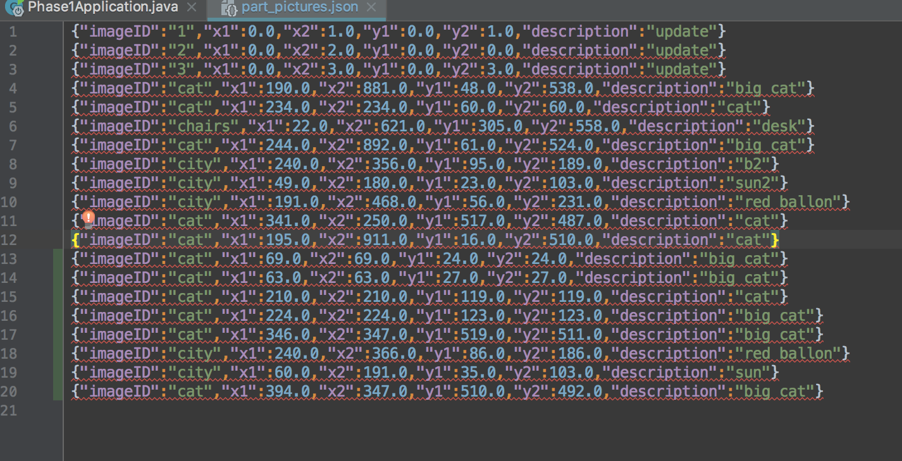

 
# UTag

## UTag - A Crowdsourcing Tags Tool

 

 
## Group Autumn
 
 

&nbsp;&nbsp;&nbsp;&nbsp;
 
 
[中文链接](ReadMEChinese.md)

&nbsp;&nbsp;
A web tag tool, Easy for configuration, Fully functional, Smooth interface, Quite flexible as the drawing tool on the PC. support gitlab Version control system,  test on Travis CI. you can get different tag experiences here.
## Requirments
<ul>
	<li>Bash(git、ssh)</li>
	<li>Java 8+</li>
	<li>maven 2.0+</li>
	<li>Chrome or Firefox</li>
</ul>

## Installation
### Method1:
<ol>
	<li>You can download the install folder from http://114.215.188.21/161250096_UTag/UTag_Phase_I/blob/master/src.zip</li>
	<li>Unzip folder "src"</li>
	<li>Use command line to enter the folder</li>
	<li>Enter: java -jar Phase_I-0.0.1-SNAPSHOT.jar</li>
</ol>

###  Method2:
<ol> 
<li>You can download source file directly</li>
git clone http://114.215.188.21/161250096_UTag/UTag_Phase_I.git</li>
<li>
Then import or open the maven project.</li>
</ol>

## Quick Start
<ol>
<li>Enter: java -jar Phase_I-0.0.1-SNAPSHOT.jar or Run the class: PhaseIApplication.java</li>
<li>Use Chrome or Firefox open the url: http://localhost:8080/</li>
<li>Given a admin user(admin/admin exists), then user the default account to sign in.(Register frame is to be updated, so use admin site)</li>
<li>Use the tag frame to tag the picture loaded</li>
</ol>

## Introduction And Screenshots
First, use the default account admin/admin to log in the system:

Then, move to the tag page:

 
The left side is the auxiliary toolbar, it contains:
<ul>
<li>
Line tool to tag</li>
<li>Box tool to tag</li>
<li>Redo</li>
<li>Anti redo</li>
<li>Delete the whole picture</li>
<li>Save the picture on the web</li>
</ul>

While at the bottom of the page:
<ul>
	<li>"PREVIOUS PICTURE" and "NEXT PICTURE" button control the load line of picture</li>
	<li>The input field is the tag to be entered</li>
	<li>The button "Check" save the tag result</li>
</ul>

Tips:
	<ul>
	<li>If you want to update the tag by box, click the box related and enter the tag again, then chek.(It will occur a blank, which is the sign of updated tag. We suggest that you use redo more than click to update)</li>
	<li>We support the service of save on the server and you can download it, the path is your default download path.
	
	
</li>
</ul>

## Tag
<ul>
<li>Whole picture tag: Just enter the tag and check; 
	Directly rewrite the tag and check to update</li>
<li>Part picture tag: Use the box and enter the tag, then check;
	Click the related box area, rewrite the tag and check to update</li>
<li>Split Area: Use the pencil tool and split the picture
The line doesn't support the update, just redo or delete if necessary</li>
<li>All the data can be seen in folder, pictures can be downloaded from the server (The split area data is only stored as x.png )</li>
</ul>

## Demo
### Whole picture tag and update

 
 

### Part picture tag and update

 
 

### Spilt the area and update

 
 

## Data
The data can be seen in json files in resources/static/data, such as part_pictures.json

## Accident
When you use the system, sometimes it may occur "Nework warning" caused by loading too much file, just wait and refresh.
Any other problems, please send mails to panyuyuyu@outlook.com.

## To Do List
<ul>
<li>Travis CI integration</li>
<li>Configure variables</li>
<li>Support Docker</li>
<li>Open api</li>
<li>Command line</li>
</ul>

## Authors
* **Autumn.NJU**
* **Yu Pan(Pypy233)**
* **Xingyu Pan(PanxyCris)**
* **Ning Li(Yotta Lee)**
* **Dixin Chen(Cindy Chen)**

## License

This project is licensed under the Apache License - see the [LICENSE](LICENSE) file for details

## Acknowledgments

* Hat tip to anyone who's code was used
* ivan(GitHub project: draw)
* Kaihang Xie
* etc

